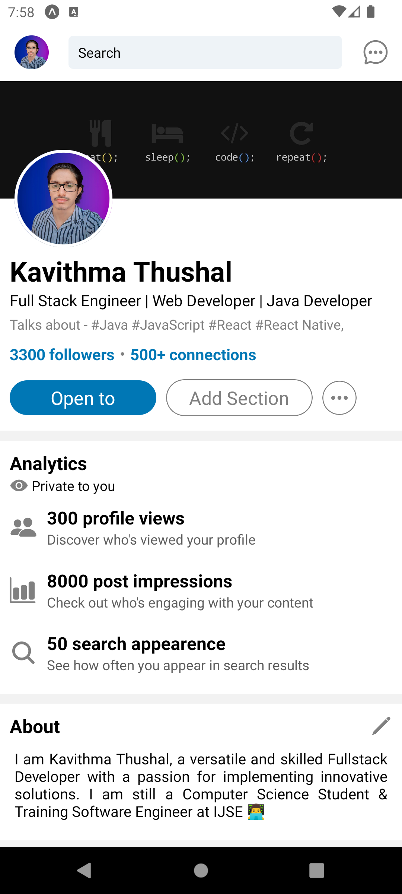
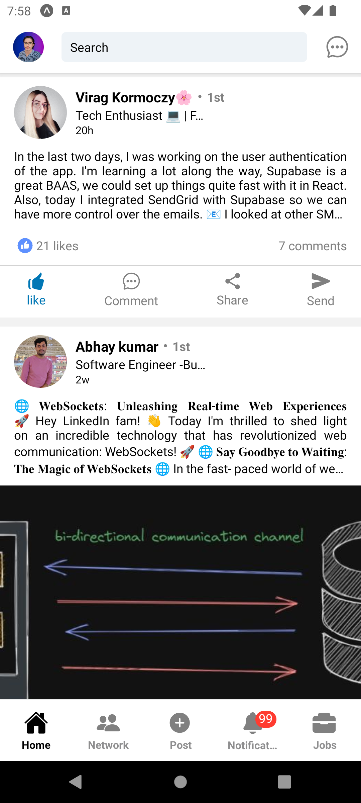
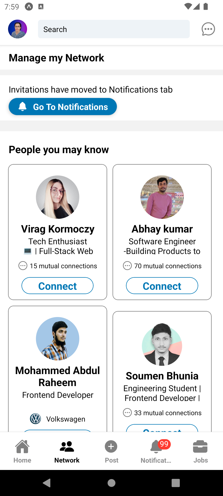
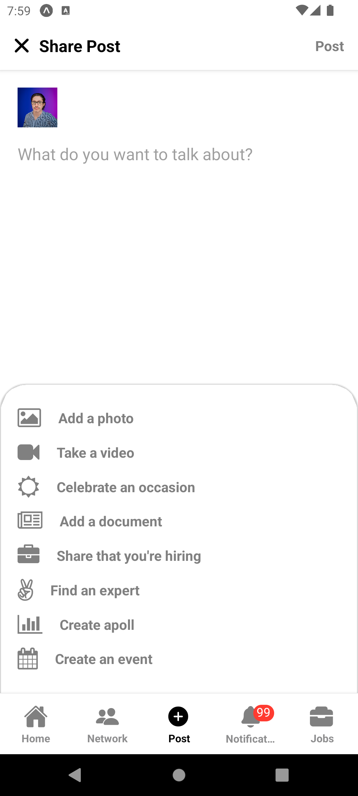
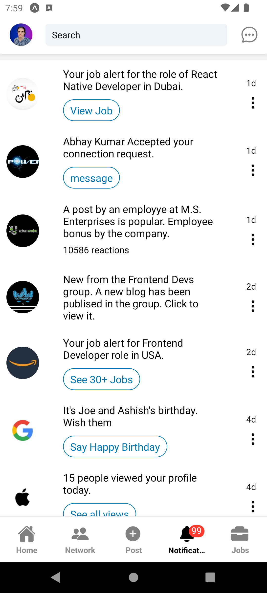
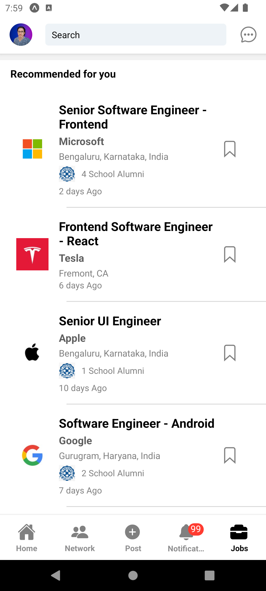

# LinkedIn Clone | React Native | Mobile Application 📱

Welcome to the LinkedIn Clone Repository! This is a mobile application built using React Native. The app aims to replicate the core features of LinkedIn, providing a platform for professionals to connect, network, and share content.

## Overview

The LinkedIn Clone app is designed to offer a professional networking experience similar to LinkedIn. It includes features that allow users to build their professional profiles, connect with colleagues, share updates, and engage in meaningful conversations. This project is ideal for those looking to understand the fundamentals of building a social networking app with modern technologies.

## Features

✅ Profile Management: Users can create and update their professional profiles, including adding a profile picture, work experience, education, and skills. 
✅ Connections: Users can search for other professionals, send connection requests, and manage their network of contacts. 
✅ News Feed: A personalized feed where users can post updates, articles, and share professional content. 
✅ Messaging: Real-time chat functionality for users to communicate directly with their connections. 
✅ Notifications: Users receive notifications for connection requests, messages, and other important updates. 
✅ Job Listings: A section for browsing and applying to job postings relevant to the user’s field and interests. 

## Technologies Used

✅ React Native 

## App Screenshots

  <table>
    <tr>
      <td align="center">
        
        
Profile

      </td>
      <td align="center">
        
        
Home

      </td>
    </tr>
    <tr>
      <td align="center">
        
        
Network

      </td>
      <td align="center">
        
        
Post

      </td>
    </tr>
    <tr>
      <td align="center">
        
        
Notification

      </td>
      <td align="center">
        
        
Jobs

      </td>
    </tr>
  </table>

## Version

1.0.0

⭐️ If you encounter any bugs or issues, or if you have questions about the code, please contact me at: 
[kavithmathushal9007@gmail.com](mailto:kavithmathushal9007@gmail.com)  

#### This project is licensed under the [Apache License](LICENSE)

#### © 2024 All Rights Reserved, Designed By [Kavithma Thushal](https://github.com/Kavithma-Thushal)

